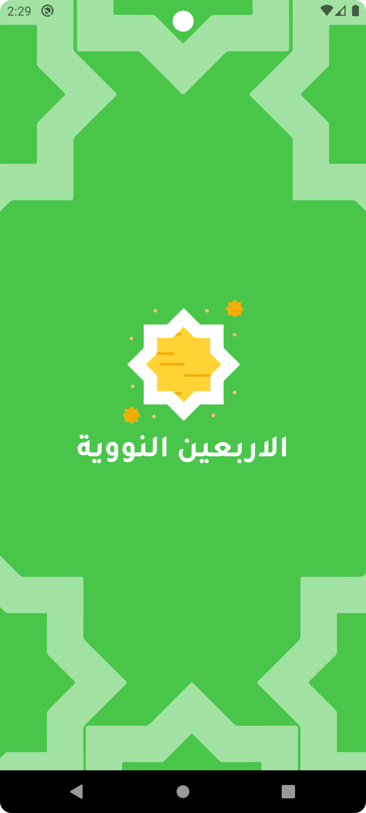
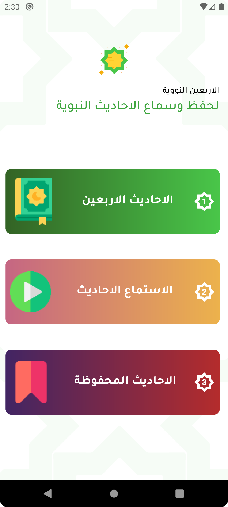
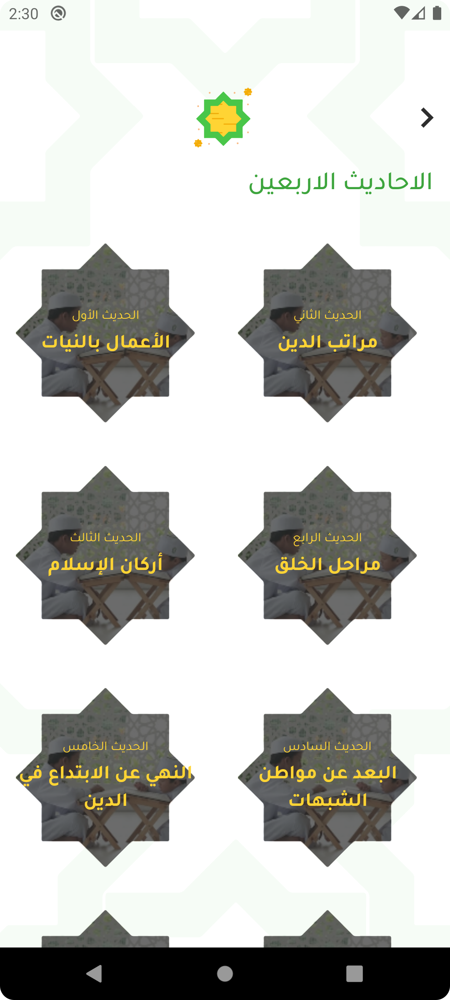
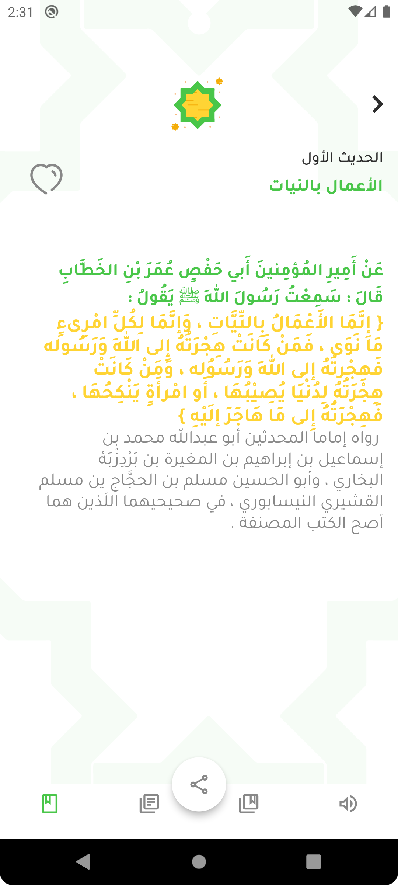
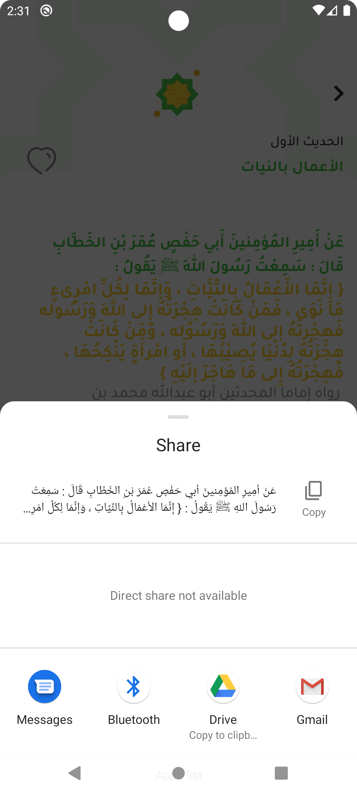
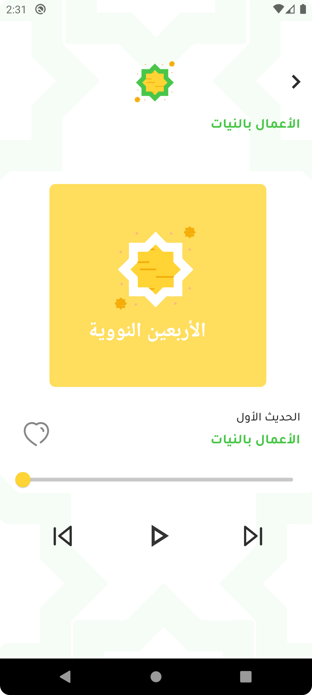

# thefortynuclear

## الاربعين النووية
برنامج لقراء وسماع الاحاديث النوويه للامام النووي

Ahadith App app is open-source app for Android & ios. It is built with Dart on top of Google's Flutter Framework.

## أربعون في مباني الإسلام وقواعد الأحكام المعروفة بـ الأربعون النووية، متن اشتمل على اثنين وأربعين حديثاّ جمعها يحيى بن شرف النووي المتوفى 676 هـ.

## Dependencies
.flutter_svg:
.audioplayers:
.share_plus:
.bloc:
.flutter_bloc:
.rename:
.google_fonts

## Screens
.Home Screen
.Home1
.Home2
.Home3
.sub
.Audio

## image

A few resources to get you started if this is your first Flutter project:

| Splash Screen                                | Home Screen                                  |
|----------------------------------------------|----------------------------------------------|
|  |  |

| Home1 Page                                    | sub1 Page                                     |
|-----------------------------------------------|-----------------------------------------------|
|  |  |

|sub1 Page details                               | Audio Page                                  |
|---------------------------------------------|---------------------------------------------|
|  |  |

